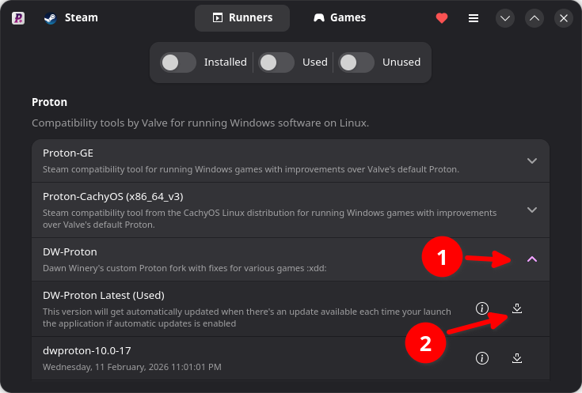

# Anime Games
Documentation on how I play gacha slop anime games.

## DWProton
- Install [ProtonPlus](https://flathub.org/apps/com.vysp3r.ProtonPlus) from flathub
- Install DWProton Latest



- Restart Steam

## General Steam Instructions
### Adding non-steam game
1. Open Steam
2. Navigate to adding non-steam game

Picture for reference:

3. Then navigate to exe of game (not the launcher)

### Setting Runner
1. Open Steam
2. Navigate to Game you want to set runner to

Picture for reference:


3. See settings cog right side of steam UI
4. Click on "Compatibility" on sidebar
5. Enable "Force the use of a specific Steam Play compatibility tool"
6. In dropdown, select DWProton (or any other runner)

### Adding Media to non-steam games using SGDBoop
1. Ensure the game you want to have media are already in your steam library (this both works for steam and non-steam entries)
2. Install [SGDBoop](https://www.steamgriddb.com/boop) to your computer
3. Visit [SteamGridDB](https://www.steamgriddb.com/) and search for the game you want to add media to
4. Hover on the image you want to add to the game entry and click the "Apply with BOOP"
:::note

This can also be done manually without SGDBoop by downloading the image and going to the game properties and clicking the "Customization" in the sidebar and applying the image manually there.

:::

## Hoyoverse
### HoYoPlay
- Install from here:

https://hoyoplay.hoyoverse.com/

- Install through wine or Steam (add as non-steam game)
    - Steam is the simplest
    - if Wine or Steam does not work run using [Bottles](https://flathub.org/en/apps/com.usebottles.bottles)

:::warning

Mouse cursor is currently bugged, offset by a little bit. Look for button highlighting instead of relying in cursor visual.

wine pop-ups like directory selection is not affected by this issue.

:::
- Download and Install games
    - Remember Install path to be used when adding to steam

### Genshin Impact and Zenless Zone Zero
- Locate installation from hoyoplay
- Add as [non-steam game](./anime-games#adding-non-steam-game)
- [Set runner to DWProton](./anime-games#setting-runner)
- Ready to Play 😀

### Honkai: Star Rail
- Locate installation from hoyoplay
- Add as [non-steam game](./anime-games#adding-non-steam-game)
- Download [Jadeite](https://codeberg.org/mkrsym1/jadeite)
- In Steam TARGET set it to:
```
"/path/to/jadeite.exe" "/path/to/StarRail.exe"
```
- [Set runner to DWProton](./anime-games#setting-runner)
- Ready to Play 😀
#### Fix bug where game would blur after normal attacking
1. Get protontricks through your distro's packagemanager
    - You can also install through [uv](../intro#python-package-manager)
        - This can be done by
        ```bash
        uv tool install protontricks
        ```
        - or use it temporarily by
        ```bash
        uvx protontricks
        ```
        (if done through this method add `uvx` before `protontricks` in the terminal)
2. Use protontricks to determine game ID 
```bash
protontricks --list
```
:::note
Example output in terminal:
```bash
protontricks --list
Non-Steam shortcut: Honkai: Star Rail (3251622364)
```

Where: `3251622364` is the Game ID

:::
3. Install mfc140, replace `gameid` with the output in protontricks
```bash
protontricks <gameid> mfc140
```

## Arknights Endfield
- Download launcher at:

https://endfield.gryphline.com/en-us#home

- Install launcher through WINE/Bottles/Steam
    - wine is simplest
- Download and Install game
- Add as [non-steam game](./anime-games#adding-non-steam-game)
    - Game Path:
    ```
    /path/to/GRYPHLINK/games/EndField Game/Endfield.exe
    ```
- [Set runner to DWProton](./anime-games#setting-runner)
- Ready to Play 😀

## Wuthering Waves
- Download on steam
- Edit launch options to:
```
SteamOS=1 %command%
```
- Ready to Play 😀

## Optional
- For FPS overlay and linux customization
   - Requires install of mangohud and gamemode
- Add in launch option:
```
mangohud gamemoderun %command%
```