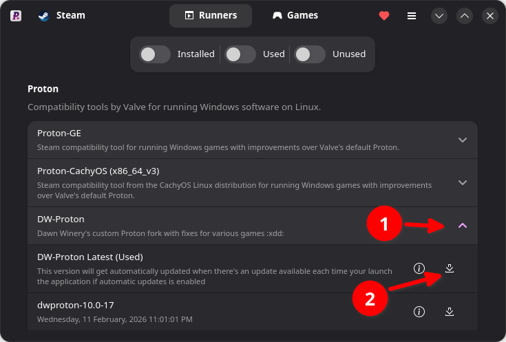
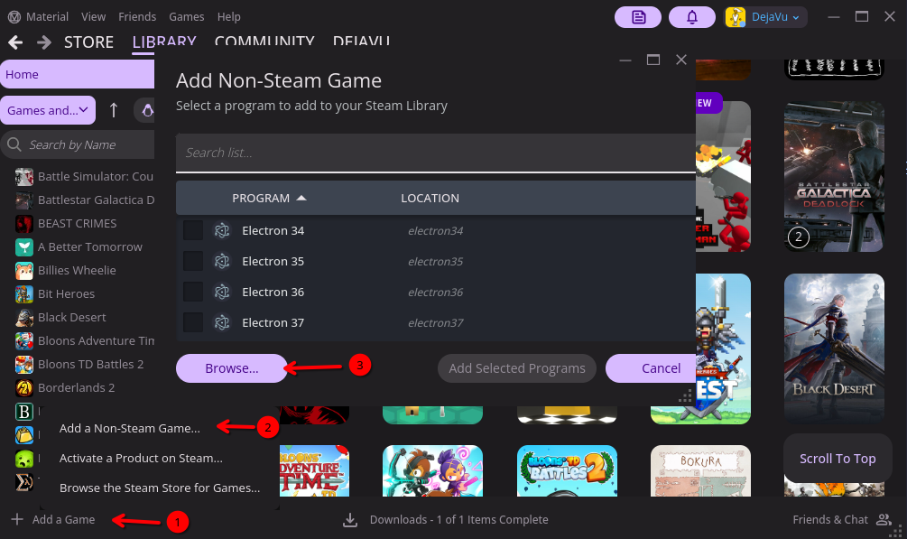
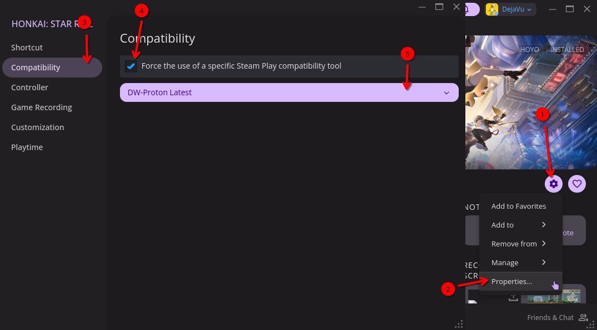

# Anime Games
Documentation on how I play gacha slop anime games.

## DWProton
- Install [ProtonPlus](https://flathub.org/apps/com.vysp3r.ProtonPlus) from flathub
- Install DWProton Latest



- Restart Steam

## General Steam Instructions
### Adding non-steam game
1. Open Steam

Picture for reference:


2. In bottom left click "Add a Game", then click adding non-steam game
3. In bottom left of the pop-up click browse
4. Then navigate to exe of game (not the launcher)
5. You can now see the game entry using the file name of the exe you selected

### Setting Runner
1. Open Steam
2. Navigate to Game you want to set runner to

Picture for reference:


3. See settings cog right side of steam UI
4. Click on "Compatibility" on sidebar
5. Enable "Force the use of a specific Steam Play compatibility tool"
6. In dropdown, select DWProton (or any other runner)

### Adding Media to non-steam games using SGDBoop
1. Ensure the game you want to have media are already in your steam library (this both works for steam and non-steam entries)
2. Install [SGDBoop](https://www.steamgriddb.com/boop) to your computer
3. Visit [SteamGridDB](https://www.steamgriddb.com/) and search for the game you want to add media to
4. Hover on the image you want to add to the game entry and click the "Apply with BOOP"
:::note

This can also be done manually without SGDBoop by downloading the image and going to the game properties and clicking the "Customization" in the sidebar and applying the image manually there.

:::

## Hoyoverse
### HoYoPlay
- Install from here:

https://hoyoplay.hoyoverse.com/

- Install through Steam (add as [non-steam game](#adding-non-steam-game))
- Set the install path somewhere easy to navigate to
    - Setting to default install path is also viable but not recommended as it would lead to searching for the prefix location which is not easily navigable

:::warning

Mouse cursor is currently bugged, offset by a little bit. Look for button highlighting instead of relying in cursor visual.

wine pop-ups like directory selection is not affected by this issue.

:::
- Download and Install games
    - Remember install path to be used when adding to steam

### Genshin Impact and Zenless Zone Zero
- Locate installation path from hoyoplay
- Add as [non-steam game](#adding-non-steam-game)
- [Set runner to DWProton](#setting-runner)

### Honkai: Star Rail
- Locate installation path from hoyoplay
- Add as [non-steam game](#adding-non-steam-game)
- Download [Jadeite](https://codeberg.org/mkrsym1/jadeite)
- In Steam TARGET set it to:
```
"/path/to/jadeite.exe" "/path/to/StarRail.exe"
```
- [Set runner to DWProton](#setting-runner)
#### Fix bug where game would blur after normal attacking
1. Get protontricks through your distro's packagemanager
    - You can also install through [uv](../intro#python-package-manager)
        - This can be done by
        ```bash
        uv tool install protontricks
        ```
        - or use it temporarily by
        ```bash
        uvx protontricks
        ```
        (if done through this method add `uvx` before `protontricks` in the terminal)
2. Use protontricks to determine game ID 
```bash
protontricks --list
```
:::note
Example output in terminal:
```bash
protontricks --list
Non-Steam shortcut: Honkai: Star Rail (3251622364)
```

Where: `3251622364` is the Game ID

:::
3. Install mfc140, replace `gameid` with the output in protontricks
```bash
protontricks <gameid> mfc140
```

## Arknights Endfield
- Download launcher at:

https://endfield.gryphline.com/en-us#home

- Install launcher through WINE/Bottles/Steam
    - wine is simplest
- Download and Install game
- Add as [non-steam game](#adding-non-steam-game)
    - Game Path:
    ```
    /path/to/GRYPHLINK/games/EndField Game/Endfield.exe
    ```
- [Set runner to DWProton](#setting-runner)

## Wuthering Waves
- Download on steam
- Edit launch options to:
```
SteamOS=1 %command%
```

## Optional launch options
- For FPS overlay and linux customization
    - Requires install of mangohud and gamemode
- Add in [launch option](https://wiki.archlinux.org/title/Steam#Launch_options):
```
mangohud gamemoderun %command%
```

## [DWProton Launch args](https://dawn.wine/dawn-winery/dwproton#new-environment-variables)
- Add to launch options
    - `%command%` should be at the end, as these are environment variables
    - See [Steam launch options](https://wiki.archlinux.org/title/Steam#Launch_options) entry in arch wiki for more info
### Enable Async
```
PROTON_DXVK_GPLASYNC=1
```
### Fix audio crackling
```
PROTON_USE_WINEALSA=1
```
### Disable NTsync, fallsback to fsync
```
PROTON_NO_NTSYNC=1
```
### Fix for games dropping inputs after alt-tab
```
WINE_USE_TAKE_FOCUS=1
```
### Disable the disconnecting trick enabled by default for certain games
```
WINE_DISABLE_DISCONNECT=1
```
### Enable the disconnecting trick for any game
```
WINE_ENABLE_DISCONNECT=1
```