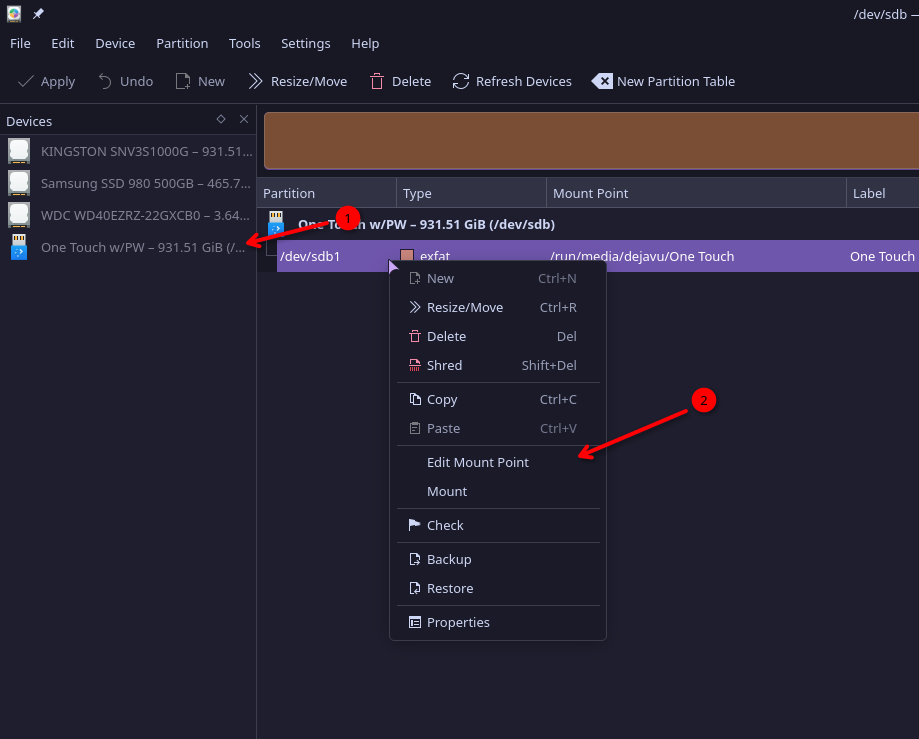
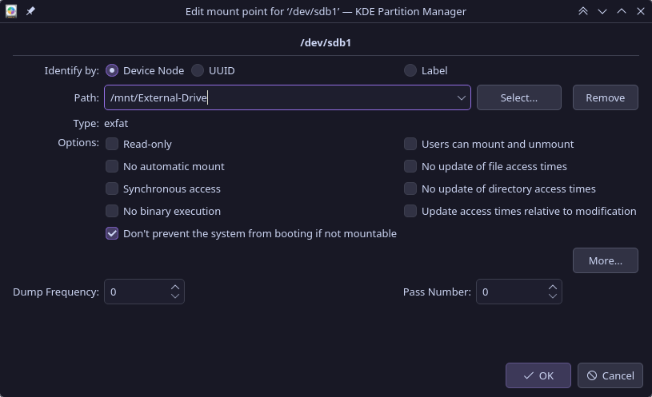

# Mounting Drives
- Instructions on mounting drives under linux.

## Local Drives
### GUI method
- KDE Partition Manager



- Then mount to desired location, this is usually located in `/mnt/`
    - `/run/media/` directory is usually reserved for `tmpfs`, which is used for temporary mounts like for thumb drives



- Uncheck "Don't prevent the system from booting if not mountable" if you need the drive to be always mounted (e.g. Data Drive)

### Terminal
- Find drive UUID
```
sudo blkid
```
Example output:

/dev/nvme0n1p1: LABEL="Progs" ***UUID="XXXXXXXX-XXXX-XXXX-XXXX-XXXXXXXXXXXX"*** UUID_SUB="XXXXXXXX-XXXX-XXXX-XXXX-XXXXXXXXXXXX" BLOCK_SIZE="4096" TYPE="btrfs" PARTUUID="XXXXXXXX-XXXX-XXXX-XXXX-XXXXXXXXXXXX"

- Use the UUID to specify the drive
- Edit fstab
```bash
sudoedit /etc/fstab
```
- Add your drive to `fstab`
```fstab
# <file system>                             <mount point>            <type>  <options>              <dump>  <pass>                              
UUID=XXXXXXXX-XXXX-XXXX-XXXX-XXXXXXXXXXXX   /mnt/External-Drive      btrfs   nofail,space_cache=v2  0       0                   
```
- Test mount point
    - If an error appears revert fstab to prevent failure of booting your system
```bash
sudo mount -a
```

## Network Drives
### CIFS
CIFS is a method to mount SMB shares
- Make a credentials file in a safe location
```bash
sudoedit /etc/win-credentials
```
    - If you have multiple network drives then just change filename
- Add to inside of file
```
username=<user>
password=<pass>
```
- Set permission for more security
```bash
sudo chmod 600 /etc/win-credentials
```
- Edit fstab
```bash
sudoedit /etc/fstab
```
- Add your drive to `fstab`
    - I recommend having `nofail` to ensure your system still boots even if the network drive is not present
```fstab
# <file system>                             <mount point>            <type>  <options>                                                                           <dump>  <pass>
//192.168.1.67/DATA                         /mnt/Network-Drive       cifs    credentials=/etc/win-credentials,vers=3.1.1,uid=1000,gid=1000,iocharset=utf8,nofail 0       0
```
- Test mount point
    - If an error appears revert fstab to prevent failure of booting your system
```bash
sudo mount -a
```
