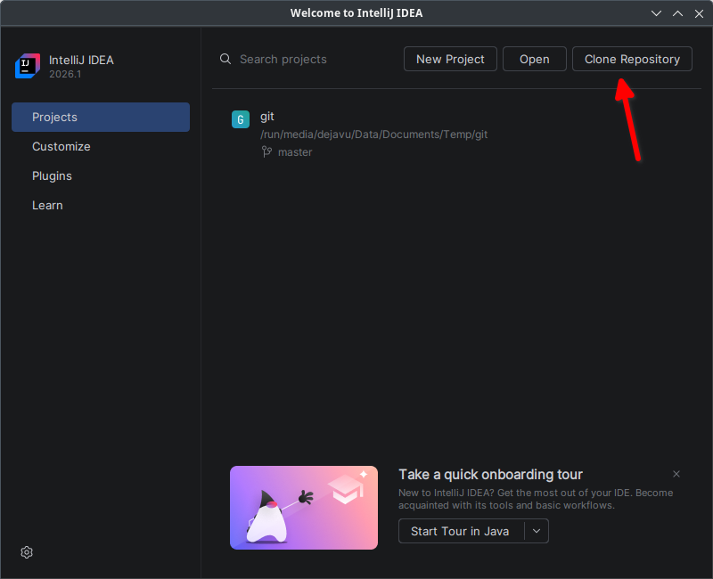
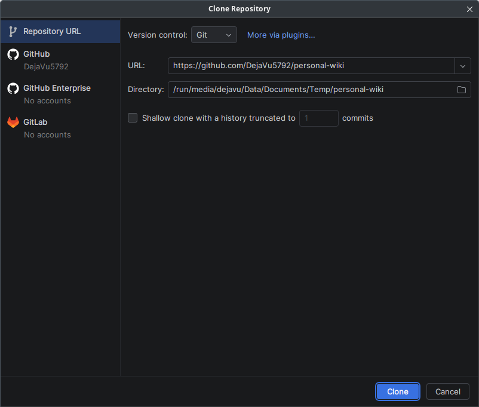
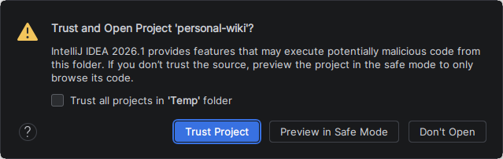
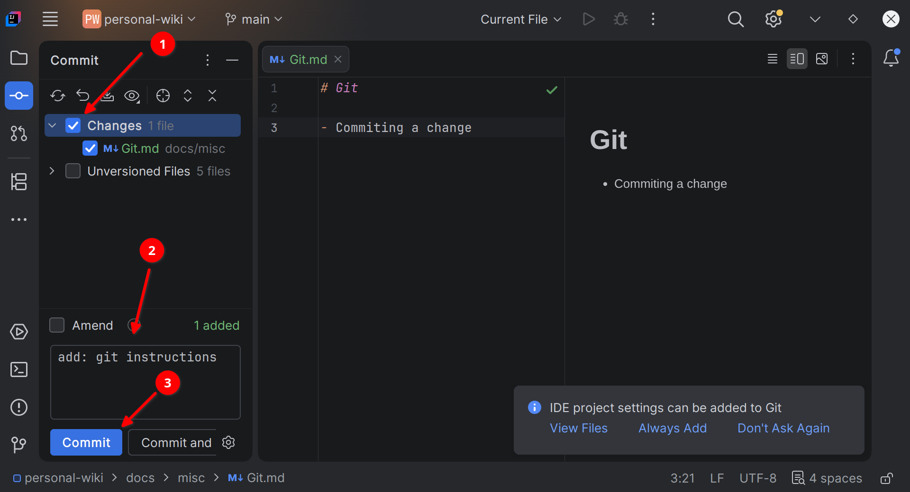
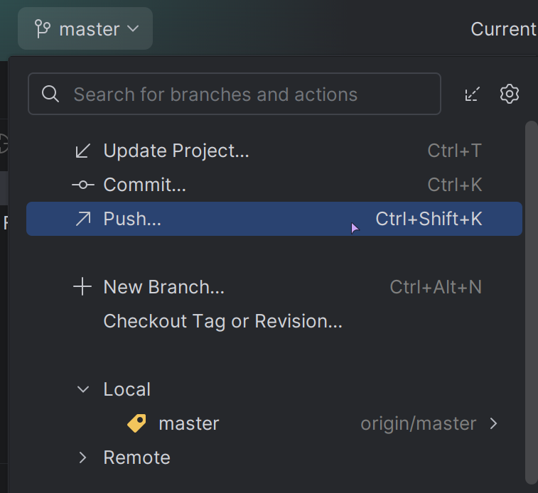
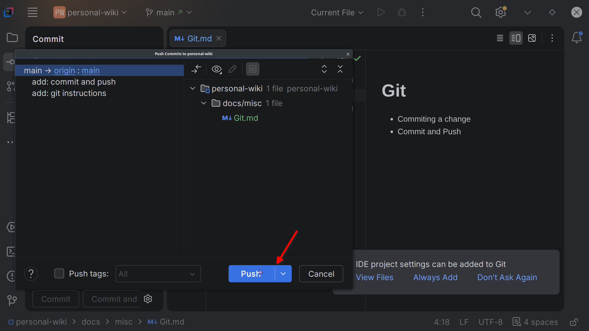

# Git
- `git` is a decentralized version control program, mostly used in GitHub, and GitLab
- This is a half-ass write up, see [Extra Resources](#extra-resources) for more information

## Key Ideas
- As `git` is decentralized **all changes are only saved in your local device by default**, that is until you push the commit to your remote repository
    - As such, when working in main/master branch always pull changes first before doing any work in the codebase to prevent conflicts
- Remote Repository are the ones hosted in services like GitHub or GitLab
- Changes are only tracked in git when you add them to be tracked
    - This depends on your IDE on how it is visualized/done
    - On the terminal this is done by `git add <path/to/file>`

## Using `git` in IDE
### IntelliJ
- Official Documentation: https://www.jetbrains.com/help/idea/using-git-integration.html
#### From Cloning a Repository
1. Press Clone Repository button

2. Enter the URL of Git repo and the directory where the repo will be placed

3. Trust the repository

#### Committing Changes

- (1) Click Checkbox to be tracked

- (2) Add Commit Message
    - As much as possible make this short and concise
    - This will be displayed on GitHub/GitLab's commit history

- (3) Commit Changes

:::tip[(See in bottom right of picture)]

Press "Always Add" for new files to be tracked by default in git

:::

#### Pushing Changes
- On top of IntelliJ

- If no conflicts are found, press the push button

## Git stuff
### .gitignore
- The file that specifies which files to not add to git repo, usually used for (but not limited to):
    - Build cache
    - Environment file (.env)
    - Files containing sensitive information (e.g. credentials)
### Branches
- TBW

## TUI
- [lazygit](https://github.com/jesseduffield/lazygit)

## Extra Resources
- [FireShip's 100s on Git](https://www.youtube.com/watch?v=hwP7WQkmECE)
- [w3schools](https://www.w3schools.com/git/)
- [webtuu's Blog](https://webtuu.com/blog/04/git-basics-branching-merging-push-to-github)