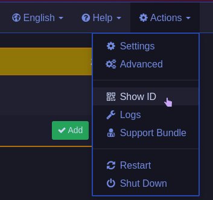
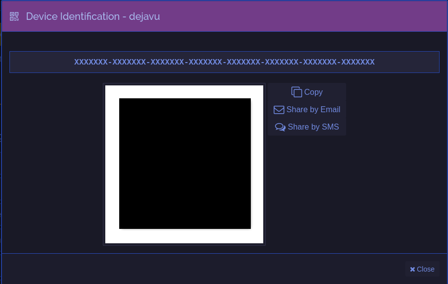
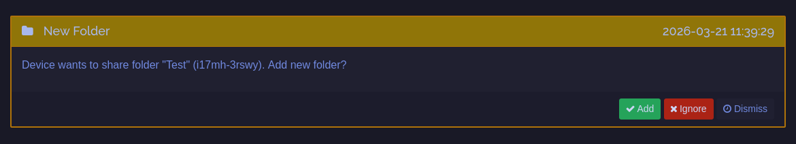
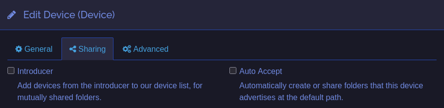
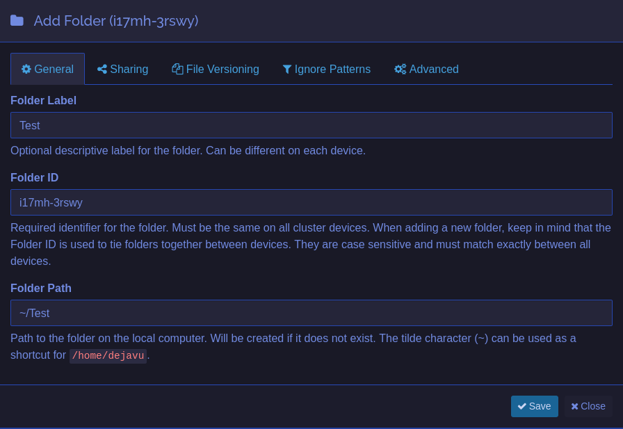

# Syncthing
Syncthing is a continuous file sync program

## Installing 
- Install [Synctrayzor](https://github.com/GermanCoding/SyncTrayzor)
    - This is a wrapper for syncthing for ease of user
    - Alternative: [Synthing Tray](https://github.com/Martchus/syncthingtray)
- Follow Setup Wizard

## Adding a Device
### On "Host" Device
1. Get the device's ID, see below for visual aid

On top right of the WebGUI

The ID in this case is "XXXXXXX-XXXXXXX-XXXXXXX-XXXXXXX-XXXXXXX-XXXXXXX-XXXXXXX-XXXXXXX"

2. Click the "Copy" button to copy the ID, this will be used later

### On "Client" Device
1. Same with adding a folder, click add to user

Click "Add", (image is reused from adding a folder)

#### Device Options

- **Introducer**
    - Recommended for a "hub" usually a server/computer that is always on
    - This is useful for when there is a lot of devices to be shared with, if *all* devices has introducer set on the hub device then syncthing will automatically share the folder with everyone
        - This is similar to how torrents work
- **Auto Accept**
    - Recommended for headless devices
    - Will add the folder to default path, usually to "Syncthing" folder

## Adding a Folder Shared to You
1. Wait for a popup to appear on top of syncthing interface

Click "Add"

2. Afterwards, change the "Folder Path" to where you want the files to be synced

## Sharing a folder to others
1. On the bottom of WebGUI, click "Add Folder"
2. Input your Folder Label and Folder Path
    - You can also change Folder ID, but default will do
3. On top of popup, go to "Sharing" tab
    - Here you will see of all the devices you have added
    - Select all devices you want the folder be shared with
4. Click "Save" if you are done