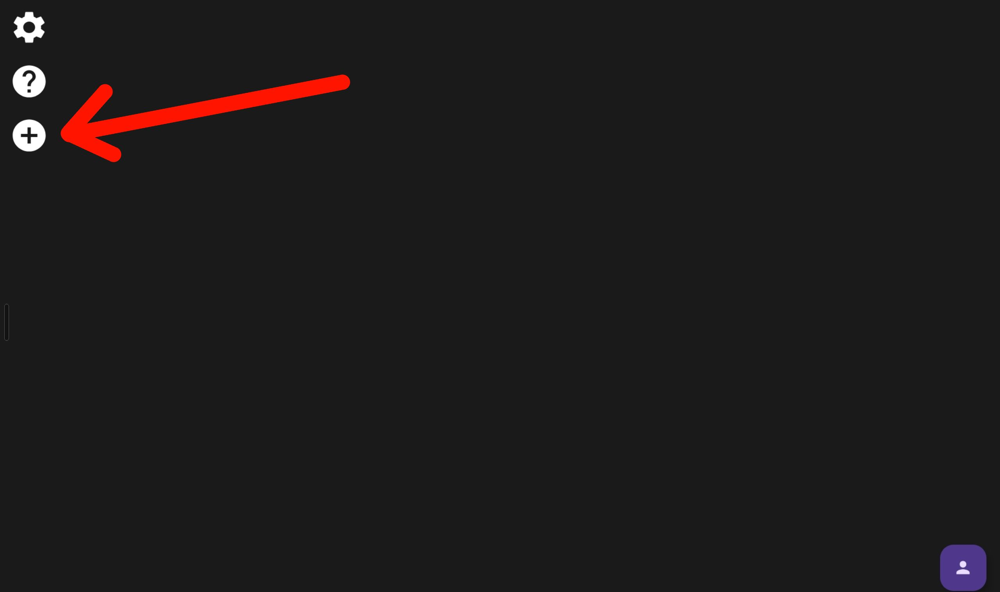
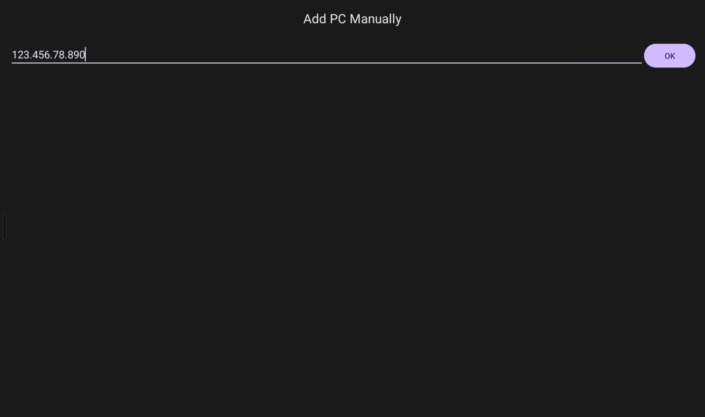
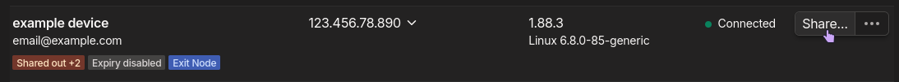

# "Local" Game Streaming
This allows you to access games or computer from anywhere.

### Setup
1. Have a [tailnet](https://tailscale.com/kb/1136/tailnet) setup.
2. Have a device that has [Sunshine](https://app.lizardbyte.dev/Sunshine/) or [Apollo](https://github.com/ClassicOldSong/Apollo) installed.
3. In the device you want to stream to install [Moonlight](https://moonlight-stream.org/) or [Artemis](https://github.com/ClassicOldSong/moonlight-android).
4. Inside Moonlight or Artemis:

:::note
IP is from tailscale, the device you want to stream from

:::
5. Profit