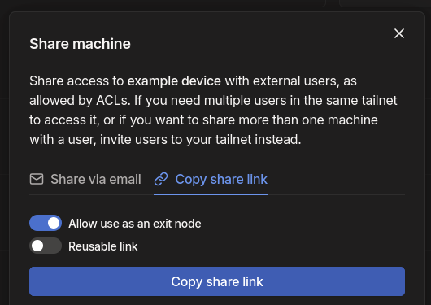

export const Highlight = ({children, color}) => (
  
    {children}
  
);

[Steam Family](https://help.steampowered.com/en/faqs/view/054C-3167-DD7F-49D4) is a steam feature that allows up to 6 people to share game copies, caveat being needing to be within same household.

## Exit Node
To bypass this limitation we can use tailscale's exit node feature.
:::info
<Highlight color="#25c2a0">Owner</Highlight> is the owner of the steam family

<Highlight color="#8839ef">Guest</Highlight> is the people that will join the steam family
:::
1. <Highlight color="#25c2a0">Owner</Highlight>: Have the owner of the steam family have a [tailnet](https://tailscale.com/kb/1136/tailnet) setup.
2. <Highlight color="#25c2a0">Owner</Highlight>: Set a device to allow exit node (If possible have this device be online 24/7 e.g. a phone)
3. <Highlight color="#25c2a0">Owner</Highlight>: Share the device

4. <Highlight color="#25c2a0">Owner</Highlight>: Send the link to others
:::warning
People who you shared this node with can have their outbound traffic go through your internet. Make sure you only share this with people you trust
:::
5. <Highlight color="#8839ef">Guest</Highlight>: Have tailscale installed on their device
6. <Highlight color="#8839ef">Guest</Highlight>: Open the link from the owner
7. <Highlight color="#8839ef">Guest</Highlight>: In tailscale settings, set the exit node to the device from the owner of the steam family.
8. <Highlight color="#25c2a0">Owner</Highlight>: Send a steam family invite link to the guest.
9. <Highlight color="#8839ef">Guest</Highlight>: Accept the invite
10. <Highlight color="#8839ef">Guest</Highlight>: Join the steam family
10. <Highlight color="#8839ef">Guest</Highlight>: Unset the exit node in tailscale. (you can now also uninstall tailscale, for the <Highlight color="#25c2a0">Owner</Highlight> can also unshare the node.)
11. ???
12. Profit