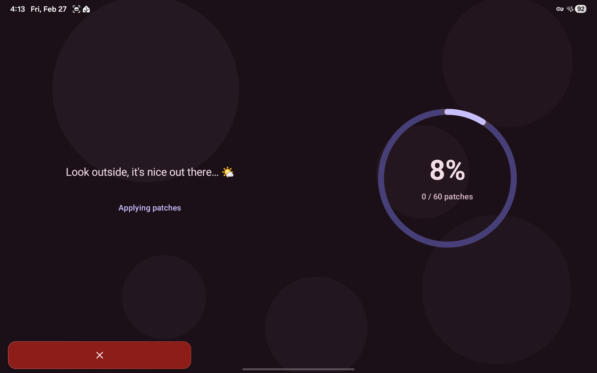
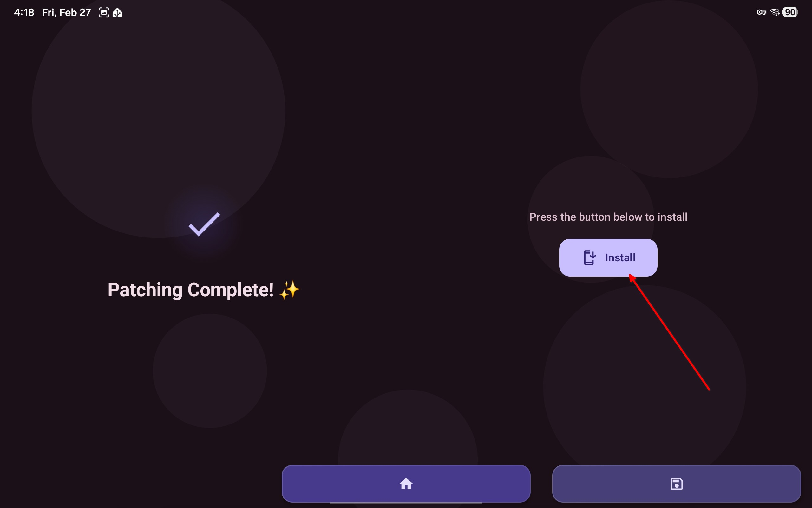
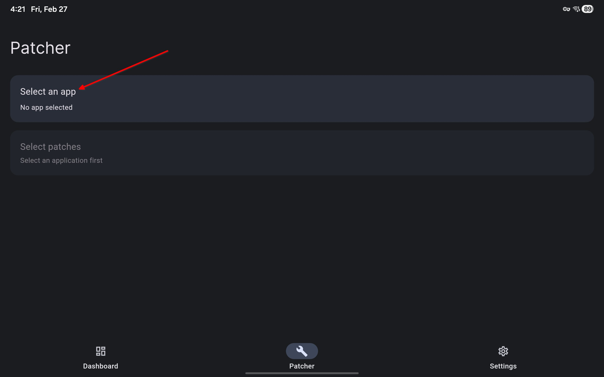
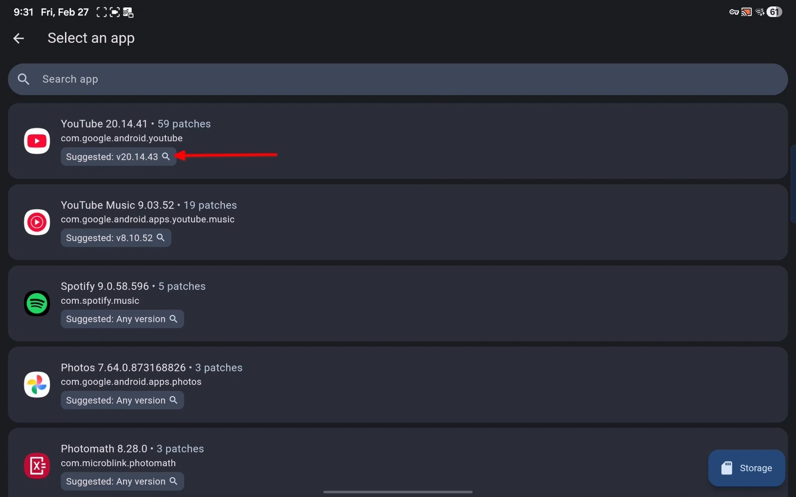
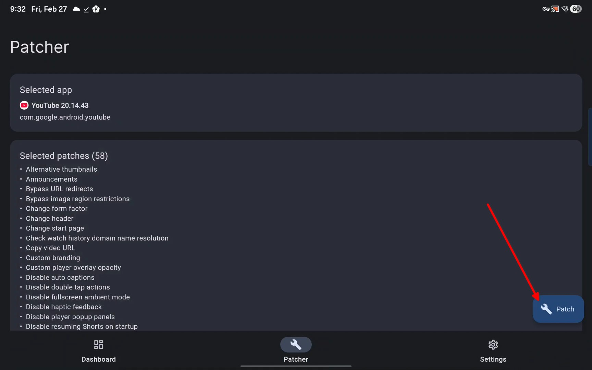

---
authors:
  - DejaVu
title: Android Apps
sidebar_position: 4
toc_max_heading_level: 4
---
# Android Apps
List of apps that are useful for getting things.

## Modded APKs
- [Mobilism](http://mobilism.org/)
  - [Mirror link](https://mobilism.me/)

## Manga
(ranked from preferred to good, top to bottom)
- [Mihon](https://github.com/mihonapp/mihon)
  - [Komikku](https://komikku-app.github.io/) ⭐, basically glorified Mihon it has Anime support and cross-device sync.
  - [Animetail](https://github.com/Animetailapp/Animetail), also a glorified Mihon it has Anime support and cross-device sync.
    - Anime extensions can be found [here](https://yuzono.github.io/docs/guides/getting-started#adding-the-extension-repo). (copy URL address, Auto install button will NOT work)
  - If need help in installing extensions there are video guides in [Wotaku](https://wotaku.wiki/guides/ext/mihon#video-guides)
- [Doki](https://github.com/DokiTeam/Doki) (Successor to [Kotatsu](https://kotatsu.app/))
  - Can import backups from kotatsu
  - Might rename to [Yaka](https://github.com/YAKATeam), only go to this link if Doki is gone.
- [Dontatsu](https://discord.gg/dantotsu)
:::tip

If you have a server: [Sync server for Komikku or Animetail](https://github.com/SyncYomi/SyncYomi) or just use GDrive

:::
:::info Extension Repos for Mihon, Komikku, or Animetail in Wotaku

Extensions list: https://wotaku.wiki/guides/ext/mihon

[For more resources see Wotaku or EverythingMoe linked here](/docs/yarr/indexes)

:::
## General Media (Anime, Movies, TV Series, etc.)
- [Cloudstream](https://github.com/recloudstream/cloudstream) ⭐
:::note[Instructions for Repos]

- In settings (bottom right), choose extensions
- Tap add repository (in bottom right)
- In URL, put megarepo
- A "Mega repository" will appear in the list of extensions, tap it
- Download "Mega"
- Go back to list to see every extension available
- Recommended Extensions: CineStream (in Megix repo), Ultima (in Phisher repo)
  - idk if these repos still exist (been too long since i setuped cloudstream lol), look in [wiki page](https://cloudstream.miraheze.org/wiki/List_of_extensions) for up to date info

:::
:::info Wiki Pages

[Official Wiki Page](https://recloudstream.github.io/csdocs/)

[Unofficial Wiki Page (Contains Extensions and Repos instructions)](https://cloudstream.miraheze.org/wiki/Main_Page)

:::
:::tip Installing in Android TV

If unable to download using browser you can make use of local send to share the APK file

[Other Methods mentioned in Wiki](https://recloudstream.github.io/csdocs/other-devices/tv/)

:::

## YouTube Android TV "Mod"
- [SmartTube](https://github.com/yuliskov/SmartTube?tab=readme-ov-file)
:::tip Changing Accounts

- Press profile picture seen in top left.
- If many accounts, you can also long press the profile picture to display a list of accounts.

:::

## Modded YouTube
:::info

For Login support install [MicroG](https://github.com/MorpheApp/MicroG-RE)

:::

### Install through [Obtainium](https://github.com/ImranR98/Obtainium/releases)

(Downloads from [FiorenMas's GitHub](https://github.com/FiorenMas/Revanced-And-Revanced-Extended-Non-Root))
#### [YouTube Morphe](https://apps.obtainium.imranr.dev/redirect?r=obtainium://app/%7B%22id%22%3A%22app.morphe.android.youtube%22%2C%22url%22%3A%22https%3A%2F%2Fgithub.com%2FFiorenMas%2FRevanced-And-Revanced-Extended-Non-Root%22%2C%22author%22%3A%22FiorenMas%22%2C%22name%22%3A%22YouTube%20Morphe%22%2C%22preferredApkIndex%22%3A0%2C%22additionalSettings%22%3A%22%7B%5C%22includePrereleases%5C%22%3Afalse%2C%5C%22fallbackToOlderReleases%5C%22%3Atrue%2C%5C%22filterReleaseTitlesByRegEx%5C%22%3A%5C%22%5C%22%2C%5C%22filterReleaseNotesByRegEx%5C%22%3A%5C%22%5C%22%2C%5C%22verifyLatestTag%5C%22%3Afalse%2C%5C%22sortMethodChoice%5C%22%3A%5C%22date%5C%22%2C%5C%22useLatestAssetDateAsReleaseDate%5C%22%3Atrue%2C%5C%22releaseTitleAsVersion%5C%22%3Afalse%2C%5C%22trackOnly%5C%22%3Afalse%2C%5C%22versionExtractionRegEx%5C%22%3A%5C%22%5C%22%2C%5C%22matchGroupToUse%5C%22%3A%5C%22%5C%22%2C%5C%22versionDetection%5C%22%3Afalse%2C%5C%22releaseDateAsVersion%5C%22%3Afalse%2C%5C%22useVersionCodeAsOSVersion%5C%22%3Afalse%2C%5C%22apkFilterRegEx%5C%22%3A%5C%22youtube-morphe%5C%22%2C%5C%22invertAPKFilter%5C%22%3Afalse%2C%5C%22autoApkFilterByArch%5C%22%3Atrue%2C%5C%22appName%5C%22%3A%5C%22YouTube%20Morphe%5C%22%2C%5C%22appAuthor%5C%22%3A%5C%22FiorenMas%5C%22%2C%5C%22shizukuPretendToBeGooglePlay%5C%22%3Afalse%2C%5C%22allowInsecure%5C%22%3Afalse%2C%5C%22exemptFromBackgroundUpdates%5C%22%3Afalse%2C%5C%22skipUpdateNotifications%5C%22%3Afalse%2C%5C%22about%5C%22%3A%5C%22%5C%22%2C%5C%22refreshBeforeDownload%5C%22%3Afalse%2C%5C%22includeZips%5C%22%3Afalse%2C%5C%22zippedApkFilterRegEx%5C%22%3A%5C%22%5C%22%7D%22%2C%22overrideSource%22%3Anull%7D) ⭐
#### [YouTube ReVanced](https://apps.obtainium.imranr.dev/redirect?r=obtainium://app/%7B%22id%22%3A%22app.revanced.android.youtube%22%2C%22url%22%3A%22https%3A%2F%2Fgithub.com%2FFiorenMas%2FRevanced-And-Revanced-Extended-Non-Root%22%2C%22author%22%3A%22Ravanced%20%2F%20FiorenMas%22%2C%22name%22%3A%22YouTube%20ReVanced%22%2C%22preferredApkIndex%22%3A0%2C%22additionalSettings%22%3A%22%7B%5C%22includePrereleases%5C%22%3Afalse%2C%5C%22fallbackToOlderReleases%5C%22%3Atrue%2C%5C%22filterReleaseTitlesByRegEx%5C%22%3A%5C%22%5C%22%2C%5C%22filterReleaseNotesByRegEx%5C%22%3A%5C%22%5C%22%2C%5C%22verifyLatestTag%5C%22%3Afalse%2C%5C%22sortMethodChoice%5C%22%3A%5C%22date%5C%22%2C%5C%22useLatestAssetDateAsReleaseDate%5C%22%3Atrue%2C%5C%22releaseTitleAsVersion%5C%22%3Afalse%2C%5C%22trackOnly%5C%22%3Afalse%2C%5C%22versionExtractionRegEx%5C%22%3A%5C%22%5C%22%2C%5C%22matchGroupToUse%5C%22%3A%5C%22%5C%22%2C%5C%22versionDetection%5C%22%3Afalse%2C%5C%22releaseDateAsVersion%5C%22%3Atrue%2C%5C%22useVersionCodeAsOSVersion%5C%22%3Afalse%2C%5C%22apkFilterRegEx%5C%22%3A%5C%22youtube-arm64-v8a-revanced.apk%5C%22%2C%5C%22invertAPKFilter%5C%22%3Afalse%2C%5C%22autoApkFilterByArch%5C%22%3Atrue%2C%5C%22appName%5C%22%3A%5C%22YouTube%5C%22%2C%5C%22appAuthor%5C%22%3A%5C%22%5C%22%2C%5C%22shizukuPretendToBeGooglePlay%5C%22%3Afalse%2C%5C%22allowInsecure%5C%22%3Afalse%2C%5C%22exemptFromBackgroundUpdates%5C%22%3Afalse%2C%5C%22skipUpdateNotifications%5C%22%3Afalse%2C%5C%22about%5C%22%3A%5C%22%5C%22%2C%5C%22refreshBeforeDownload%5C%22%3Afalse%2C%5C%22includeZips%5C%22%3Afalse%2C%5C%22zippedApkFilterRegEx%5C%22%3A%5C%22%5C%22%2C%5C%22dontSortReleasesList%5C%22%3Afalse%7D%22%2C%22overrideSource%22%3Anull%7D)

### Manually Building
#### Morphe ⭐
1. Download [Morphe Manager](https://morphe.software/)
2. Open manager
3. Tap YouTube

4. Choose "Yes, help me find an APK"
    - if you already have downloaded the APK choose the latter option, then skip to step 8

5. Tap "Continue to APKMirror.com"

6. Download YouTube APK

7. Then tap "Open APK file"

8. Wait for patching to complete, this usually takes a couple of minutes

9. Press install button

#### ReVanced
1. Download [ReVanced Manager](https://revanced.app/)
2. Open manager
3. Tap "Select an app"

4. Tap the version numer under YouTube

5. Find APKMirror in search results, download APK from APKMirror

6. Open ReVanced Manager, tap the storage button in bottom left

7. Tap the patch button in bottom left

8. Wait for patching to finish

9. Install
