import Tabs from '@theme/Tabs';
import TabItem from '@theme/TabItem';

## YouTube Android TV "Mod"
- [TizenTube Cobalt](https://github.com/reisxd/TizenTubeCobalt)
    - Has similar UI to official YouTube ATV
- [SmartTube](https://github.com/yuliskov/SmartTube)

:::tip[Changing Accounts in SmartTube]

- Press profile picture seen in top left.
- If many accounts, you can also long press the profile picture to display a list of accounts.

:::

- For Samsung Tizen TVs: [TizenTube](https://github.com/reisxd/TizenTube)

## Modded YouTube
:::info

For Login support install [MicroG](https://github.com/MorpheApp/MicroG-RE)

:::

### Install through [Obtainium](https://github.com/ImranR98/Obtainium/releases/latest/download/app-release.apk)

(Downloads from [FiorenMas's GitHub](https://github.com/FiorenMas/Revanced-And-Revanced-Extended-Non-Root))
#### [YouTube Morphe](https://apps.obtainium.imranr.dev/redirect?r=obtainium://app/%7B%22id%22%3A%22app.morphe.android.youtube%22%2C%22url%22%3A%22https%3A%2F%2Fgithub.com%2FFiorenMas%2FRevanced-And-Revanced-Extended-Non-Root%22%2C%22author%22%3A%22FiorenMas%22%2C%22name%22%3A%22YouTube%20Morphe%22%2C%22preferredApkIndex%22%3A0%2C%22additionalSettings%22%3A%22%7B%5C%22includePrereleases%5C%22%3Afalse%2C%5C%22fallbackToOlderReleases%5C%22%3Atrue%2C%5C%22filterReleaseTitlesByRegEx%5C%22%3A%5C%22%5C%22%2C%5C%22filterReleaseNotesByRegEx%5C%22%3A%5C%22%5C%22%2C%5C%22verifyLatestTag%5C%22%3Afalse%2C%5C%22sortMethodChoice%5C%22%3A%5C%22date%5C%22%2C%5C%22useLatestAssetDateAsReleaseDate%5C%22%3Atrue%2C%5C%22releaseTitleAsVersion%5C%22%3Afalse%2C%5C%22trackOnly%5C%22%3Afalse%2C%5C%22versionExtractionRegEx%5C%22%3A%5C%22%5C%22%2C%5C%22matchGroupToUse%5C%22%3A%5C%22%5C%22%2C%5C%22versionDetection%5C%22%3Afalse%2C%5C%22releaseDateAsVersion%5C%22%3Afalse%2C%5C%22useVersionCodeAsOSVersion%5C%22%3Afalse%2C%5C%22apkFilterRegEx%5C%22%3A%5C%22youtube-morphe%5C%22%2C%5C%22invertAPKFilter%5C%22%3Afalse%2C%5C%22autoApkFilterByArch%5C%22%3Atrue%2C%5C%22appName%5C%22%3A%5C%22YouTube%20Morphe%5C%22%2C%5C%22appAuthor%5C%22%3A%5C%22FiorenMas%5C%22%2C%5C%22shizukuPretendToBeGooglePlay%5C%22%3Afalse%2C%5C%22allowInsecure%5C%22%3Afalse%2C%5C%22exemptFromBackgroundUpdates%5C%22%3Afalse%2C%5C%22skipUpdateNotifications%5C%22%3Afalse%2C%5C%22about%5C%22%3A%5C%22%5C%22%2C%5C%22refreshBeforeDownload%5C%22%3Afalse%2C%5C%22includeZips%5C%22%3Afalse%2C%5C%22zippedApkFilterRegEx%5C%22%3A%5C%22%5C%22%7D%22%2C%22overrideSource%22%3Anull%7D) ⭐
#### [YouTube ReVanced](https://apps.obtainium.imranr.dev/redirect?r=obtainium://app/%7B%22id%22%3A%22app.revanced.android.youtube%22%2C%22url%22%3A%22https%3A%2F%2Fgithub.com%2FFiorenMas%2FRevanced-And-Revanced-Extended-Non-Root%22%2C%22author%22%3A%22Ravanced%20%2F%20FiorenMas%22%2C%22name%22%3A%22YouTube%20ReVanced%22%2C%22preferredApkIndex%22%3A0%2C%22additionalSettings%22%3A%22%7B%5C%22includePrereleases%5C%22%3Afalse%2C%5C%22fallbackToOlderReleases%5C%22%3Atrue%2C%5C%22filterReleaseTitlesByRegEx%5C%22%3A%5C%22%5C%22%2C%5C%22filterReleaseNotesByRegEx%5C%22%3A%5C%22%5C%22%2C%5C%22verifyLatestTag%5C%22%3Afalse%2C%5C%22sortMethodChoice%5C%22%3A%5C%22date%5C%22%2C%5C%22useLatestAssetDateAsReleaseDate%5C%22%3Atrue%2C%5C%22releaseTitleAsVersion%5C%22%3Afalse%2C%5C%22trackOnly%5C%22%3Afalse%2C%5C%22versionExtractionRegEx%5C%22%3A%5C%22%5C%22%2C%5C%22matchGroupToUse%5C%22%3A%5C%22%5C%22%2C%5C%22versionDetection%5C%22%3Afalse%2C%5C%22releaseDateAsVersion%5C%22%3Atrue%2C%5C%22useVersionCodeAsOSVersion%5C%22%3Afalse%2C%5C%22apkFilterRegEx%5C%22%3A%5C%22youtube-arm64-v8a-revanced.apk%5C%22%2C%5C%22invertAPKFilter%5C%22%3Afalse%2C%5C%22autoApkFilterByArch%5C%22%3Atrue%2C%5C%22appName%5C%22%3A%5C%22YouTube%5C%22%2C%5C%22appAuthor%5C%22%3A%5C%22%5C%22%2C%5C%22shizukuPretendToBeGooglePlay%5C%22%3Afalse%2C%5C%22allowInsecure%5C%22%3Afalse%2C%5C%22exemptFromBackgroundUpdates%5C%22%3Afalse%2C%5C%22skipUpdateNotifications%5C%22%3Afalse%2C%5C%22about%5C%22%3A%5C%22%5C%22%2C%5C%22refreshBeforeDownload%5C%22%3Afalse%2C%5C%22includeZips%5C%22%3Afalse%2C%5C%22zippedApkFilterRegEx%5C%22%3A%5C%22%5C%22%2C%5C%22dontSortReleasesList%5C%22%3Afalse%7D%22%2C%22overrideSource%22%3Anull%7D)

### Manually Building
<Tabs defaultValue="Morphe">
  <TabItem value="Morphe" label="Morphe ⭐">
    

    
Click here to see Morphe Instructions

    1. Download [Morphe Manager](https://morphe.software/)
    2. Open manager
    3. Tap YouTube
    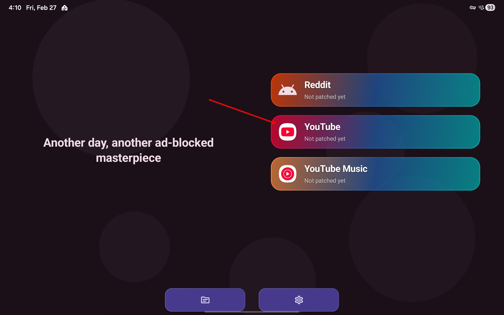

    4. Choose "Yes, help me find an APK"
        - if you already have downloaded the APK choose the latter option, then skip to step 8

    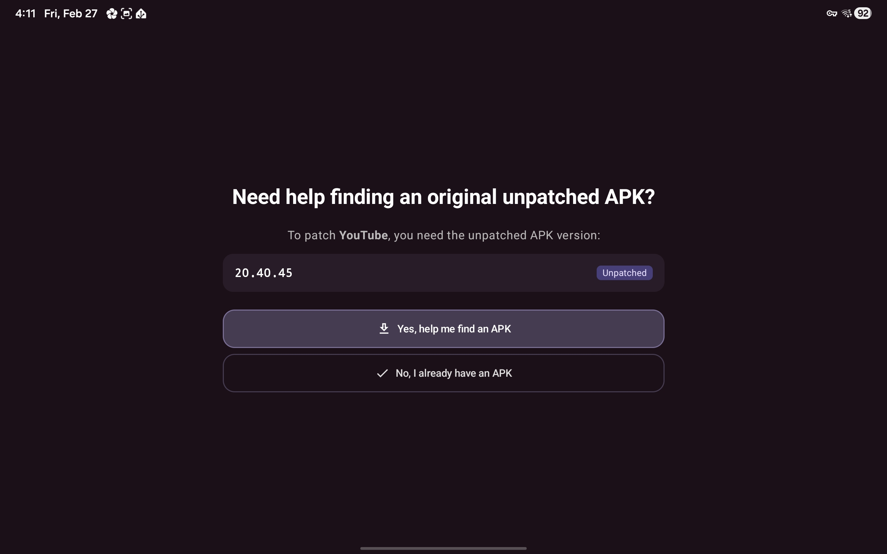

    5. Tap "Continue to APKMirror.com"

    6. Download YouTube APK
    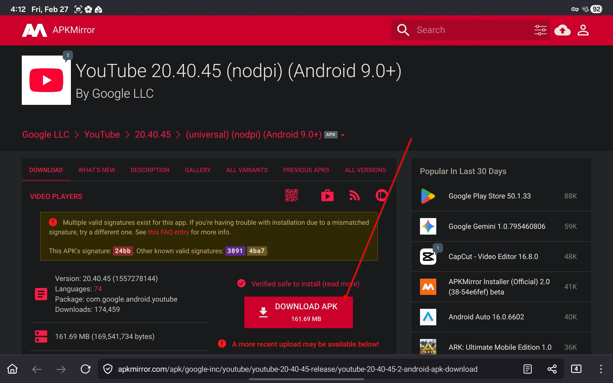

    7. Then tap "Open APK file"
    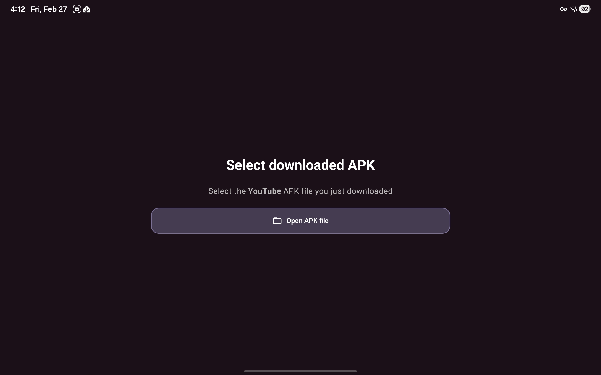

    8. Wait for patching to complete, this usually takes a couple of minutes
    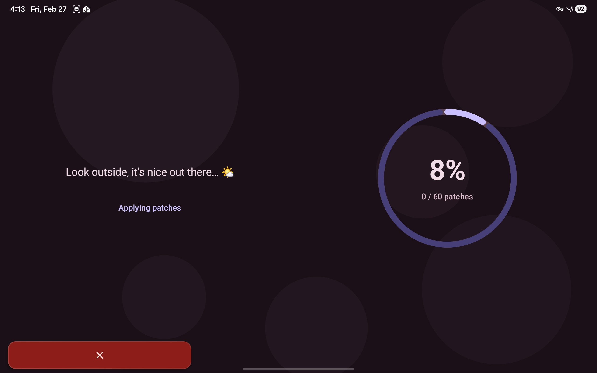

    9. Press install button
    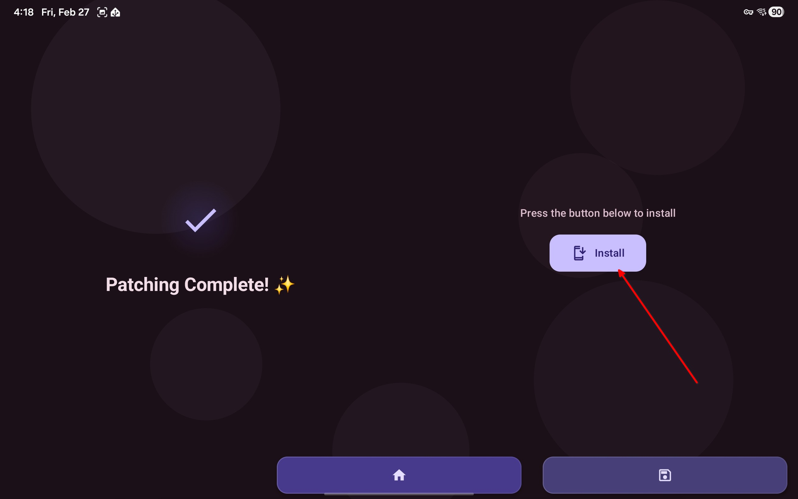

    

  </TabItem>
  <TabItem value="ReVanced" label="ReVanced">
    

      
Click here to see ReVanced Instructions

      1. Download [ReVanced Manager](https://revanced.app/)
      2. Open manager
      3. Tap "Select an app"
      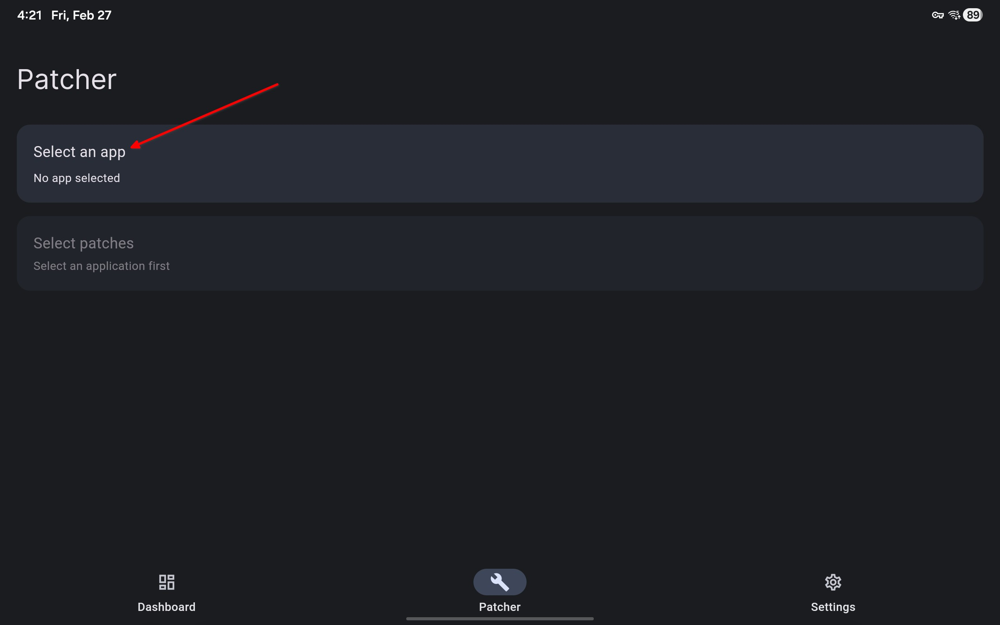

      4. Tap the version numer under YouTube
      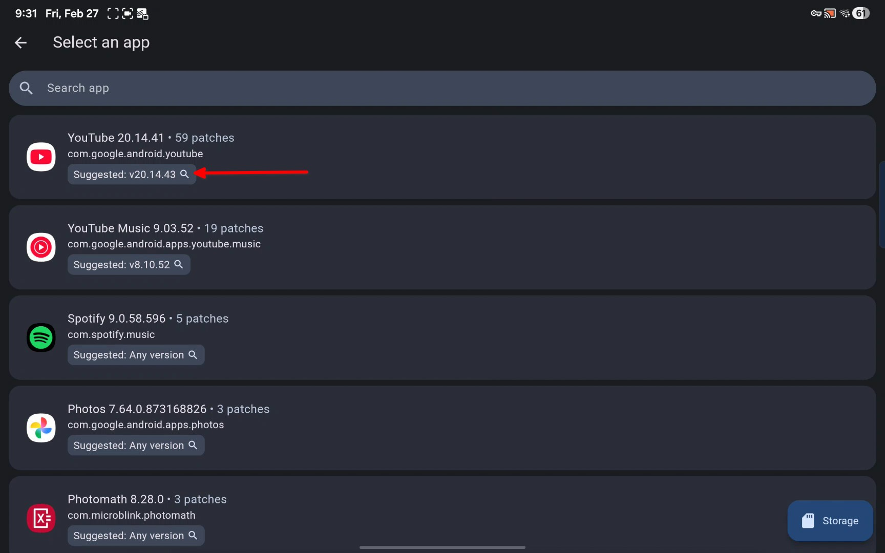

      5. Find APKMirror in search results, download APK from APKMirror
      

      6. Open ReVanced Manager, tap the storage button in bottom left
      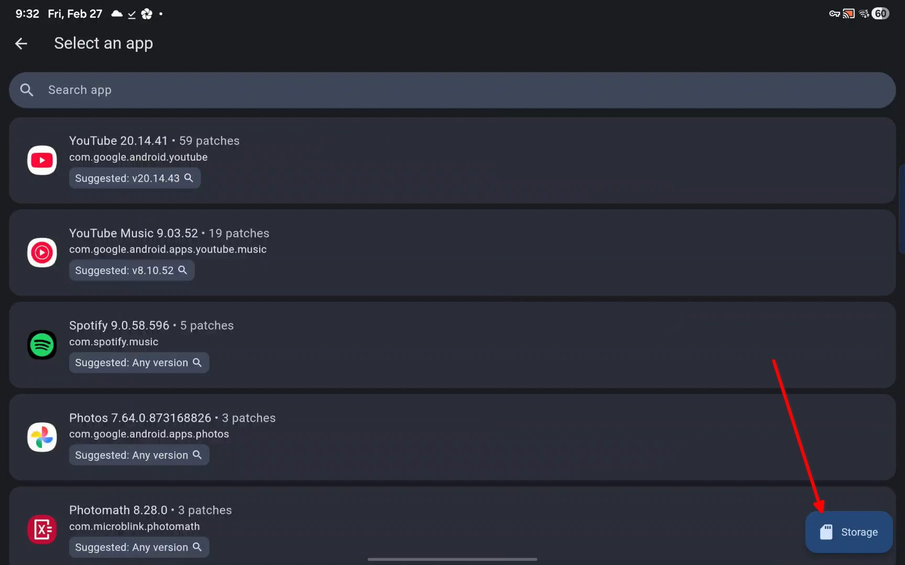

      7. Tap the patch button in bottom left
      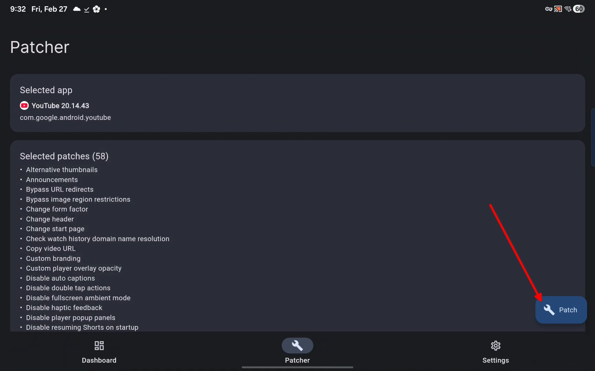

      8. Wait for patching to finish

      9. Install
      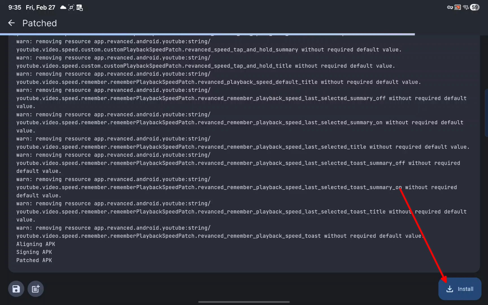
    

  </TabItem>
</Tabs>

### YouTube Music
- [Metrolist](https://github.com/mostafaalagamy/Metrolist) ⭐
    - Custom client for YouTube Music
    - Goated
